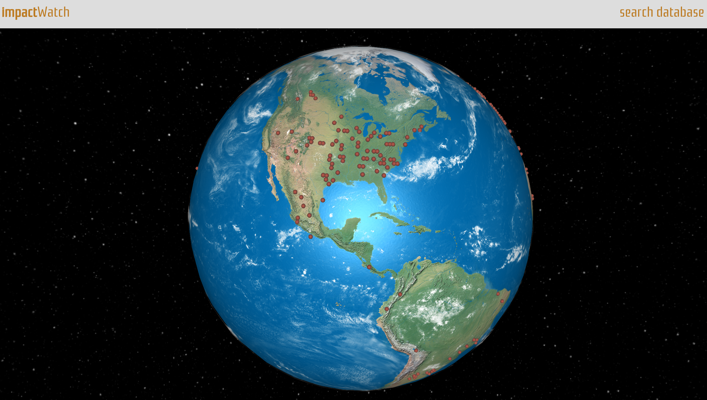
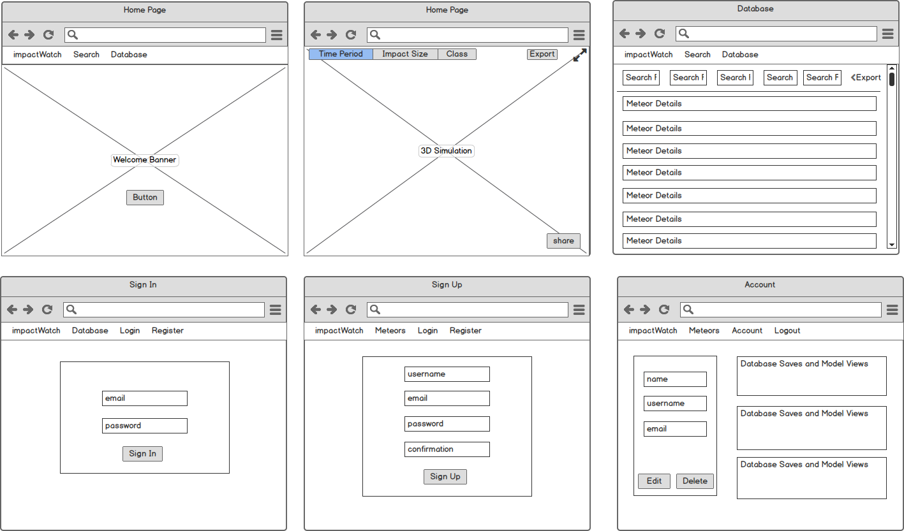

# impactWatch
---


impactWatch captures NASA's Meteorite Landings API and renders the data into a dynamic 3D model of the Earth. The model allows researchers to visualize any impact(s) on the Earth and share that data through CSV files.

## Author
William Namen

## Wireframe


## Future Development
Due to the short timeframe of my given development period (1 week), there were many features left out of the application. Expect to see the following updates over time:

1. The search features of the model will be eventually embedded within the model canvas. This will give users easy access to search and filter the 3D model.

2. The search features will also be updated with more advanced search tools. Expect to see a dynamic timeline filter where you can set a beginning and end date of impacts.  Also, a location and region feature will be added.

3. A maximize button will be added to the top right corner of the model which will hide the nav bar and provide a more immersive experience.

4. More dynamic sharing options! The initial scope of the project revolved around the ability to share your particular views and filters with other researchers, however, due to limited time frame, I pivoted to an easier option, CSV exports. Buttons will be added to take screenshots of the model and share either the screenshot or particular views through social mediums.

5. Animations! I am hoping to add a simple animation showing each meteorite falling to their exact impact point on Earth.

Additionally, I am always open to any suggestions to add (or fix) features in upcoming versions of this application.

## Technologies
1. JavaScript
2. Node.js
3. MongoDB
4. three.js
5. WebGL
6. NASA's Open API - Meteorite Landings
6. Foundation
7. JQuery
8. Heroku

## Code Examples
### Point Creation
```
function createPoint(radius, segments, data) {

  //get the data, and set the offset, we need to do this since the x,y coordinates
  //from the data aren't in the correct format
  var x = parseInt(data[0]);
  var y = parseInt(data[1]);

  // calculate the position where we need to start the cube
  var position = latLongToVector3(x, y, 0, .5);

  // create the point
  var pointGeometry = new THREE.SphereGeometry(.005,.005,.005);
  var pointMaterial = new THREE.MeshPhongMaterial( { color: 0x771E10 });
  var point = new THREE.Mesh( pointGeometry, pointMaterial);

  // position the point correctly
  point.position = position;
  point.lookAt( new THREE.Vector3(0,0,0) );
  point.name = 'point';

  // and add the point to the scene
  scene.add(point);
}
```
### Point Conversion
```
function latLongToVector3(lat, lon, radius, heigth) {
  var phi = (lat)*Math.PI/180;
  var theta = (lon-180)*Math.PI/180;

  var x = -(radius+heigth) * Math.cos(phi) * Math.cos(theta);
  var y = (radius+heigth) * Math.sin(phi);
  var z = (radius+heigth) * Math.cos(phi) * Math.sin(theta);

  return new THREE.Vector3(x,y,z);
}
```
### Model Search Function
```
function handleNameSearch(e) {

  e.preventDefault();
  removePoints();

  $.ajax({
    method: "GET",
    url: "https://data.nasa.gov/resource/y77d-th95.json",
    dataType: 'JSON',
    data: $(this).serialize().slice(0,5) + $(this).serialize().charAt(5).toUpperCase() + $(this).serialize().slice(6),
  }).done(function (data) {

    dataCSV = data;

    data.forEach(function (point) {
      var coord = [point.reclat, point.reclong]
      createPoint(radius, segments, coord);
    });
  })

  $(this).trigger("reset");
}
```
### Point Removal
```
function removePoints() {
  for (var i = 0; i < scene.children.length; i++) {
    var child = scene.children[i];
      if (child.name === "point") {
        scene.remove(child);
        i--
      }
  }
}
```
### CSV Export Function
```
function handleExportCSV(args) {
  var data, filename, link;
  var csv = convertArrayOfObjectsToCSV({
      data: dataCSV
  });

  if (csv == null) return;

  filename = 'meteorite-data.csv';

  if (!csv.match(/^data:text\/csv/i)) {
      csv = 'data:text/csv;charset=utf-8,' + csv;
  }
  data = encodeURI(csv);

  link = document.createElement('a');
  link.setAttribute('href', data);
  link.setAttribute('download', filename);
  link.click();
}
```

## Recognitions
I want to thank the following for their work and tutorials. I would not have been able to complete this project in such a short amount of time without them!

* Bjorn Sandvik - https://github.com/turban/webgl-earth &
http://thematicmapping.org/
* Eberhard Graether - http://egraether.com/
* alteredq - http://alteredqualia.com/
* mr.doob - http://mrdoob.com/
* Chris Grimes - https://github.com/halis & http://halistechnology.com/2015/05/28/use-javascript-to-export-your-data-as-csv/

Last, but not least... I want to thank my instructors for all their guidance and help throughout my bootcamp and projects. I have come a long way in 12 weeks and would not have been able to complete something as challenging as this without them!

* Cory Fauver - https://github.com/cofauver
* Brianna Veenstra -  https://github.com/bgveenstra
* Matt Laguardia - https://github.com/mattlaguardia
